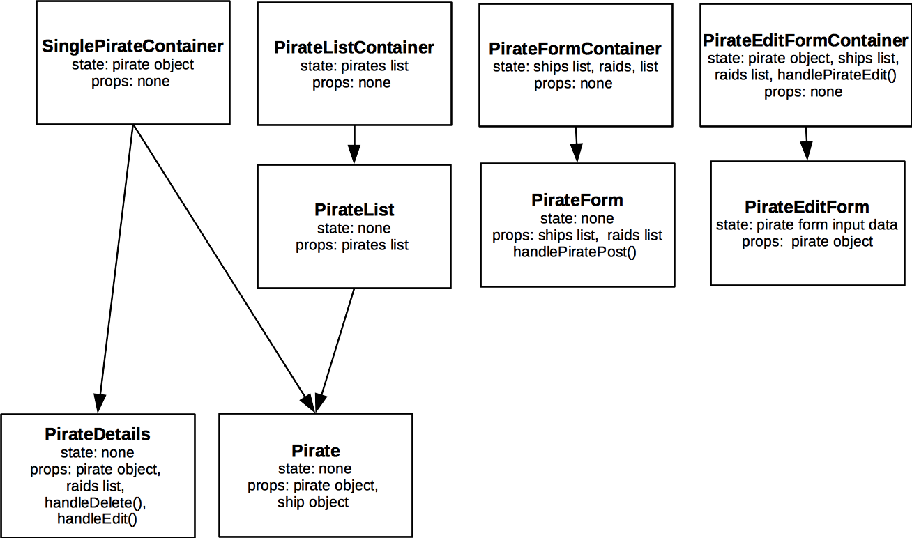

#  Full Stack App (Java + React)

## Introduction

It's really important to understand how the architecture of the back-end of an application affects the front-end. This is because in many cases problems can be fixed in both places, and a fix for a solution of the front-end, might create a problem in the back-end or vice versa.

## Lesson

In this lesson, we would like you to read through and understand the full-stack architecture of an application.  There's a Spring back-end and a react front-end for the pirates application you're familiar with.

Review the provided code in `pirates_on_board`. Then complete the following tasks:

### Task 1: Draw Diagram

Draw the component diagram detailing props and state

> 

### Task 2: Answer the questions
 * How do `PirateEditFormContainer` and `SinglePirateContainer` get the `id` of the selected pirate?

   > Respectively, from `PirateEditForm.js` and `Pirate.js`   by accessing `props.pirate.id`.

 * Where are the requests made?

   > `PirateFormContainer.js`,  `PirateEditFormContainer.js`, `SinglePirateContainer.js` and `PirateListContainer.js`

### Task 3: Understand and reflect on:

 * Please read: [https://coursework.vschool.io/setting-up-a-full-stack-react-application/](https://coursework.vschool.io/setting-up-a-full-stack-react-application/)
    * Look at `package.json` on the line  ` "proxy": "http://localhost:8080/"` to see where our proxy is setup.

    * Look through each request and write the full URL given what you know about the proxy

   > * http&#58;//localhost:8080/api/pirates
   > * http&#58;//localhost:8080/api/pirates/{id}/?projection=embedShip
   > * http&#58;//localhost:8080/api/ships
   > * http&#58;//localhost:8080/api/raids